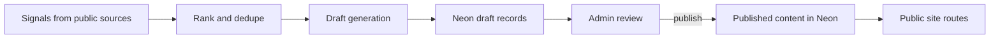

# Hermes Signal

Hermes Signal is the public content site for the Hermes content engine.
It takes trend signals, turns them into structured drafts, stores the drafts in Neon, and publishes the approved content as a small editorial site built with Next.js.

## Project summary

The system is intentionally split into clear stages:

1. **Collect signals** from public sources like Reddit, RSS, GitHub, and similar realtime feeds.
2. **Rank signals** so the most useful items rise to the top.
3. **Draft articles** from those ranked signals with a consistent editorial structure.
4. **Generate article assets** for the draft.
5. **Store everything in Neon** so the content stays structured and reviewable.
6. **Approve or reject drafts** through the admin UI.
7. **Render published articles** on the public site.

That keeps the site grounded in structured data instead of static markdown or hand-edited blobs.

## What Hermes Signal does

- Ingests trend signals on a schedule
- Scores and deduplicates signals
- Converts ranked signals into article drafts
- Persists drafts, sections, and assets in Neon
- Provides an admin review flow for publishing
- Serves a public article site from published records
- Uses a preview-safe fallback catalog so the site does not die when the live publish path is incomplete

## Main features

### Signal ingestion

- Pulls public trend data from source adapters
- Normalizes items into `signal_items`
- Stores evidence separately in `signal_evidence`
- Uses a score-based ordering so the most interesting items are drafted first

### Draft generation

- Converts ranked signals into structured draft posts
- Generates article metadata:
  - title
  - slug
  - excerpt
  - topic
- Breaks the article into sections like:
  - signal
  - why it matters
  - practical tip
  - next step
- Keeps draft assets attached to the draft record

### Content storage

The Neon schema is structured on purpose:

- `signal_items`
- `signal_evidence`
- `draft_posts`
- `draft_sections`
- `draft_assets`

### Admin review and publishing

- Admin page at `/admin`
- Drafts can be approved or rejected
- Published drafts stay in Neon instead of being copied into the repo
- Public pages read published content from the content store

### Public site

- Home page: `/`
- Archive: `/archive/`
- Topic pages: `/topics/[topic]/`
- Article pages: `/articles/[slug]/`
- Built with Next.js App Router
- Uses dynamic routes for live content

### Preview/runtime behavior

- The public site is designed to stay up even if the direct content path is incomplete in preview
- Article pages use a fallback publication catalog so preview deploys remain usable
- This avoids the old hard-coded-only behavior that made published content disappear

## Content flow



## Repository layout

- `src/ingest/` — signal collection, ranking, and Neon ingestion helpers
- `src/content/` — draft generation, storage, and publication helpers
- `src/lib/` — shared signal/draft/article asset logic
- `src/app/` — Next.js routes and UI
- `db/schema.sql` — Neon schema for signals, drafts, sections, and assets
- `scripts/` — runnable jobs for ingesting signals and generating drafts

## Commands

### Install and run

```bash
yarn install
yarn dev
```

### Test

```bash
yarn vitest run
```

### Typecheck

```bash
yarn typecheck
```

### Build

```bash
yarn build
```

### Ingest signals

```bash
yarn ingest:signals
```

This job reads from public trend sources and stores ranked signals in Neon using a direct `DATABASE_URL`.

### Draft articles

```bash
yarn draft:signals
```

This job:

1. Reads the top-ranked signals from Neon
2. Generates a structured draft with title, slug, excerpt, sections, and asset metadata
3. Stores the result in `draft_posts`, `draft_sections`, and `draft_assets`
4. Leaves the draft ready for admin review
5. Lets the public site render the published article once it is approved

## Data model

### `signal_items`

Stores the ranked signal records that feed the draft pipeline.

Key fields include:
- source
- source item ID
- canonical URL
- published timestamp
- summary
- practical tip
- topic
- score

### `signal_evidence`

Stores supporting evidence for each signal as ordered text rows.

### `draft_posts`

Stores article-level draft records.

Key fields include:
- signal item reference
- title
- slug
- excerpt
- topic
- status
- generated timestamp
- published timestamp

### `draft_sections`

Stores ordered article sections for each draft.

### `draft_assets`

Stores article asset metadata for each draft.

## Environment

Set a direct Neon connection string in `DATABASE_URL`.

The ingest and draft jobs use the direct database URL path, not a pooled URL.

## Deployment

Deployment is handled outside the repo. The app is built with Next.js and configured for the deployment environment used by Coolify/Nixpacks.

## Notes

- The codebase prefers structured content over ad hoc blobs.
- The content engine is meant to stay inspectable and reviewable.
- The public site should fail soft where possible, not just 500 on preview.
